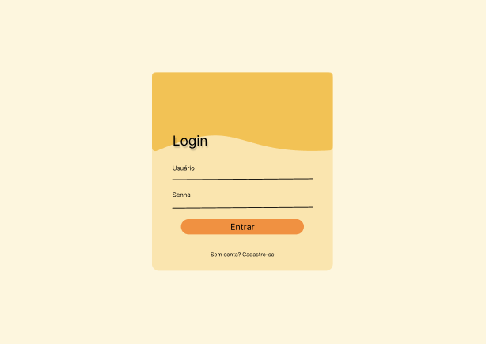
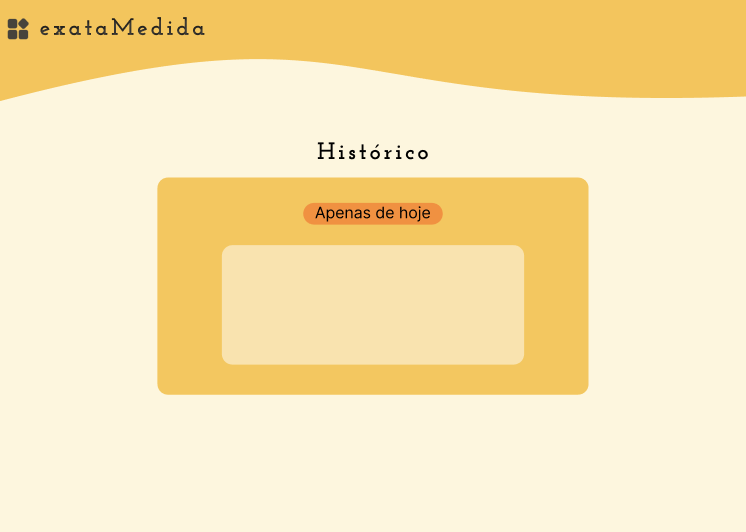

# Conversor_De_Medidas_RecodeJr
# 🚀 Conversor de Medidas - Projeto Final

  <strong>Status do Projeto:</strong> Concluído ✔️

---

  Um projeto web multi-página desenvolvido como parte do processo seletivo da Recode Jr. O que começou como um simples conversor de medidas evoluiu para uma aplicação funcional com sistema de autenticação, perfil de usuário e uma estrutura de código modular e moderna.

---

### ✨ Funcionalidades Implementadas

O projeto conta com uma série de funcionalidades que criam uma experiência de usuário completa:

* **🔐 Sistema de Autenticação:** Telas de Login e Cadastro com formulários interativos que alternam entre si sem a necessidade de recarregar a página.
* **📏 Conversor de Medidas:** A página principal da aplicação, onde o usuário pode realizar conversões de unidades (atualmente configurado para converter minutos em segundos como prova de conceito).
* **👤 Página de Perfil:** Uma área dedicada onde o usuário pode gerenciar suas informações e, como destaque técnico, realizar o **upload de uma foto de perfil com pré-visualização instantânea**.
* **📖 Página de Histórico:** Uma tela já estruturada e pronta para receber a funcionalidade de listagem de conversões passadas.
* **🧭 Menu Lateral Dinâmico:** Um componente de navegação reutilizável que é carregado dinamicamente em todas as páginas, garantindo um código limpo e de fácil manutenção (Princípio DRY).

---

### 📸 Demonstração Visual

| Tela de Login/Cadastro | Tela Principal (Conversor) |
| :---: | :---: |
|  |  |

| Tela de Perfil (com upload) | Tela de Histórico |
| :---: | :---: |
|  |  |

---

### 🛠️ Tecnologias Utilizadas

* **HTML5:** Para a estruturação semântica de todas as páginas e componentes.
* **CSS3:** Para a estilização completa, utilizando Flexbox para layouts, `transform` para animações e um design responsivo e moderno.
* **JavaScript (ES6+):** Utilizado de forma pura (Vanilla JS) para controlar toda a interatividade do projeto.
* **Git & GitHub:** Para o versionamento de código e gerenciamento do projeto.

---

### 🚀 Conceitos Técnicos Aplicados

* **Manipulação do DOM:** Uso intensivo de `getElementById`, `querySelector` e `classList.toggle` para criar uma experiência dinâmica.
* **Event Handling:** Gerenciamento de eventos de clique (`onclick`, `addEventListener`) para controlar botões e a navegação.
* **Modularização de Código:** Separação de responsabilidades em diferentes arquivos CSS e JS para cada funcionalidade, facilitando a manutenção.
* **Fetch API:** Utilizada para carregar o componente do menu (`menu.html`) de forma assíncrona, evitando a repetição de código HTML nas páginas.
* **File API:** Implementada na página de perfil para permitir que o usuário carregue uma imagem local e a pré-visualize na tela através do `URL.createObjectURL()`.

---

### ▶️ Como Executar o Projeto

Este projeto utiliza a `Fetch API` para carregar componentes, o que exige que ele seja executado a partir de um servidor local devido às políticas de segurança dos navegadores (CORS).

**A forma mais simples é usando a extensão `Live Server` no Visual Studio Code:**

1.  Clone este repositório: `git clone https://github.com/seu-usuario/seu-repositorio.git`
2.  No VS Code, vá na aba de Extensões, procure por **"Live Server"** e instale.
3.  Com o projeto aberto, clique com o botão direito em um dos arquivos HTML (como `login.html` ou `index.html`).
4.  Selecione a opção **"Open with Live Server"**.
5.  O projeto será aberto no seu navegador padrão, pronto para uso!

---

### 👨‍💻 Autor

Feito por Ana Laysa Carvalho e Arthur Legal

